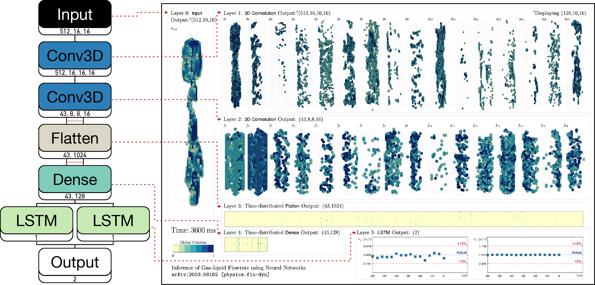

## Visualizing layer activation during axial transit 

The dropbox folders linked below hold videos that visualize how a neural network infers gas-liquid superficial
velocities from high-resolution high-frequency 3D void fraction distributions.  Details available at
[arXiv:2003.08182 [physics.flu-dyn]](https://arxiv.org/abs/2003.08182) ("Model E" is used to
generate output presented). All nomenclature from the paper are preserved.

There are two variants of .mp4 files available:
- [**high_res**](https://www.dropbox.com/sh/zwfbpc449w45s1o/AADTt51ytsHm4J6h0zpn4Ybma?dl=0): contains videos with 3300x2160 resolution at 15 fps (~360 MB each)
- [**low_res**](https://www.dropbox.com/sh/cr270wxj6hrykcn/AABqsTHll1Xd1jL8qkB-Anz8a?dl=0): contains videos with 1650x1080 resolution at 15 fps (~100 MB each)

### Post-processing for visualization
For the **Input** and **Conv3D** layers, thresholds were applied to minimize occlusion of voxels. 
For *Layer 0*, the threshold is [0.9, 1.0].
For *Layer 1* and *Layer 2*, the threshold varied as [μ-σ, μ+2σ].
For **Flatten**, **Dense**, and **LSTM** layers, no post-processing was applied.

### Video Layout

### Visualization Tools

The feature maps were extracted from a lightly customized version of [keract](https://github.com/philipperemy/keract).
All visualizations were generated in MATLAB. 
The 3D void fraction distributions were generated using [PATCH_3Darray](https://www.mathworks.com/matlabcentral/fileexchange/28497-plot-a-3d-array-using-patch). 
All other plots were generated from the standard MATLAB library.
